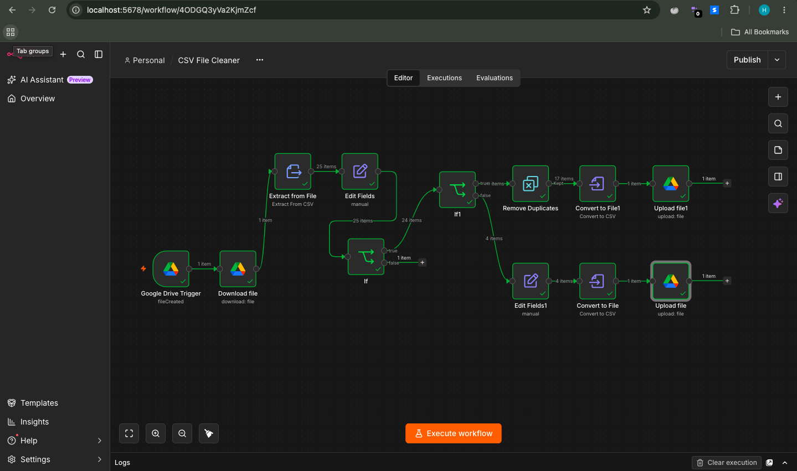

# CSV Cleaner Workflow

## Workflow Name

CSV Cleaner Workflow

---

## Workflow Objective

This workflow automatically processes CSV files uploaded to a Google Drive folder, cleans and standardises the data, validates email addresses, removes duplicate records, and generates separate outputs for valid and rejected records.

The workflow demonstrates core n8n concepts including file processing, data transformation, validation, conditional logic, duplicate handling, error handling, and Google Drive integration.

---

## Workflow Logic

1. A Google Drive Trigger monitors the designated Raw CSV folder for new CSV files.
2. The uploaded CSV file is downloaded from Google Drive.
3. The CSV data is extracted and converted into JSON format.
4. An Edit Fields node performs data cleaning:
   - Trims leading and trailing spaces from all fields.
   - Standardises name casing (e.g., jOHN doe → John Doe).
   - Converts email addresses to lowercase.
5. An IF node removes fully empty rows.
6. A second IF node validates email formats using a regex pattern.
7. Valid records proceed to duplicate removal.
8. Duplicate records are removed based on the Name and Email field.
9. Clean records are converted back into CSV format and uploaded to the Clean CSV folder in Google Drive.
10. Invalid email records are routed to a separate branch, tagged with a rejection reason, converted back into CSV format, and uploaded to the Rejected Rows folder.
11. Both outputs are preserved for auditing and review.

---

## Workflow Design

```text
Google Drive Trigger
↓
Download File
↓
Extract CSV
↓
Clean Fields
↓
IF Empty Row Check
↓
IF Email Validation
┌──────────┴──────────┐
│ │
Valid Email Invalid Email
│ │
Remove Duplicates Add Rejection Reason
(By Email) │
│ │
Convert to CSV Convert to CSV
│ │
Upload Clean CSV Upload Rejected CSV
```

---

## Nodes Used
 
| Node | Purpose |
|----------|----------|
| Google Drive Trigger | Monitors Raw CSV folder |
| Google Drive Download File | Retrieves uploaded CSV file |
| Extract From File (CSV) | Converts CSV data into JSON |
| Edit Fields (Data Cleaning) | Cleans and standardises records |
| IF (Empty Row Check) | Removes fully empty rows |
| IF (Email Validation) | Validates email format |
| Remove Duplicates | Removes duplicate names and emails |
| Edit Fields (Rejection Reason) | Adds rejection reason to invalid rows |
| Convert To CSV | Converts clean records back to CSV |
| Convert To CSV | Converts rejected records back to CSV |
| Google Drive Upload File | Stores clean CSV output |
| Google Drive Upload File | Stores rejected CSV output |
 
---
 
## Workflow Components
 
### 1. Google Drive Trigger
 
The workflow begins with a Google Drive Trigger node configured to monitor the **Raw CSV** folder.
 
Whenever a new CSV file is added to the folder, the workflow is automatically triggered.
 
---
 
### 2. Google Drive Download File
 
The Download File node retrieves the uploaded CSV file using the file ID provided by the trigger.
 
This makes the file contents available for processing within the workflow.
 
---

### 3. Extract From CSV

The Extract From File node converts the CSV file into JSON records.

Example CSV:

```csv
Name,Email,Department
 jOHN doe , JOHN@EMAIL.COM ,IT
Jane Smith,jane@email.com,HR
```

Example JSON Output:

```json
{
  "Name": " jOHN doe ",
  "Email": " JOHN@EMAIL.COM ",
  "Department": "IT"
}
```

This conversion allows each CSV row to be processed individually throughout the workflow.

---

### 4. Edit Fields (Data Cleaning)

The Edit Fields node standardises incoming data before validation.

Cleaning Rules:

- Trim leading and trailing spaces.
- Convert names to proper case.
- Convert email addresses to lowercase.

Configured Expressions:

**Name**

```javascript
{{ $json.Name.trim().toLowerCase().split(' ').map(name => name.charAt(0).toUpperCase() + name.slice(1)).join(' ') }}
```

**Email**

```javascript
{{ $json.Email.trim().toLowerCase() }}
```

**Department**

```javascript
{{ $json.Department.trim() }}
```

Examples:

| Before | After |
|----------|----------|
| ` jOHN doe ` | `John Doe` |
| ` JOHN@EMAIL.COM ` | `john@email.com` |
| `   Sales ` | `Sales` |

This ensures all records follow a consistent format before validation and deduplication.

---

### 5. IF Node (Empty Row Check)

The workflow checks whether a row contains any meaningful data.

Expression:

```javascript
{{ !!($json.Name || $json.Email || $json.Department) }}
```

Validation Rule:

```text
At least one field must contain data.
```

Rows that are completely empty are discarded from the workflow.

Example rejected row:

```csv
,,
```

Result:

```text
FALSE
```

Example accepted row:

```csv
John Doe,,IT
```

Result:

```text
TRUE
```

This ensures only fully empty rows are removed, while partially completed records continue to validation.

---

### 6. IF Node (Email Validation)

The workflow validates email addresses using a regular expression.

Expression:

```javascript
{{ /^[A-Za-z0-9._%+-]+@[A-Za-z0-9.-]+\.[A-Za-z]{2,}$/.test($json.Email) && !$json.Email.includes('..') }}
```

Validation Rules:

- Email must contain an @ symbol.
- Email must contain a valid domain.
- Email must contain a valid extension.
- Email must not contain consecutive dots.

Valid examples:

```text
john.doe@example.com
jane@test.org
info@company.net
```

Invalid examples:

```text
john@email
john@@email.com
chris.white@example..com
```

The workflow then branches based on the result.

```text
TRUE  → Valid Email Branch
FALSE → Rejected Rows Branch
```

---

### 7. Remove Duplicates

The Remove Duplicates node removes duplicate records using the Email field as the unique identifier.

Configuration:

```text
Operation:
Remove Items Repeated Within Current Input

Compare Field:
All fields except Department

Keep:
First Occurrence
```

Example:

Input:

```csv
John Doe,john@email.com
Jane Smith,jane@email.com
JOHN DOE,john@email.com
```

Output:

```csv
John Doe,john@email.com
Jane Smith,jane@email.com
```

Duplicate records are excluded from the final clean dataset.

---

### 8. Edit Fields (Rejection Reason)

Records that fail email validation are routed to the False branch.

An Edit Fields node adds a rejection reason before generating the rejected CSV file.

Added Field:

```text
Rejection Reason
```

Value:

```text
Invalid Email Format
```

Example:

```json
{
  "Name": "Chris White",
  "Email": "chris.white@example..com",
  "Department": "Support",
  "RejectionReason": "Invalid Email Format"
}
```

This provides a clear audit trail explaining why a record was rejected.

---

### 9. Convert To CSV (Clean Records)

Valid and deduplicated records are converted back into CSV format.

Example Output:

```csv
Name,Email,Department
John Doe,john@email.com,IT
Jane Smith,jane@email.com,HR
```

This CSV represents the final cleaned dataset.

---

### 10. Upload Clean CSV

The cleaned CSV file is uploaded to the **Clean CSV** folder in Google Drive.

Example filename:

```text
cleaned_rows_2026-09-29_18-15.csv
```

Output Folder:

```text
Google Drive
└── Clean CSV
```

---

### 11. Convert To CSV (Rejected Records)

Rejected records are converted into a separate CSV file.

Example Output:

```csv
Name,Email,Department,RejectionReason
Chris White,chris.white@example..com,Support,Invalid Email Format
John Doe,john@email,IT,Invalid Email Format
```

This ensures that invalid records are preserved rather than lost.

---

### 12. Upload Rejected CSV

The rejected records file is uploaded to the **Rejected Rows** folder in Google Drive.

Example filename:

```text
rejected_rows_2026-09-29_18-15.csv
```

Output Folder:

```text
Google Drive
└── Rejected Rows
```

The rejected CSV can be reviewed later for correction and reprocessing.

---

## Assumptions

- Incoming files are CSV format.
- CSV columns include:
  - Name
  - Email
  - Department
- Email addresses must follow standard email formatting.
- Duplicate records are identified solely by Email address.
- Invalid records must be preserved rather than discarded.
- Google Drive folders are pre-created before workflow execution.
- Rejected records are stored in a separate CSV file for auditing purposes.

---

## Sample Test Data

```csv
Name,Email,Department
 jOHN doe ,JOHN@EMAIL.COM,IT
Jane Smith,jane@email.com,HR
Bob Brown,bob@email,Sales
John Doe,john@email.com,IT
JOHN DOE,john@email.com,IT
,,
Chris White,chris.white@example..com,Support
```

Expected Results:

```text
Total Rows: 7
Clean Records: 3
Duplicate Records Removed: 1
Rejected Records: 2
Empty Rows Removed: 1
```

---

## Testing Performed

| Test Case | Expected Result | Status |
|------------|----------------|---------|
| Valid CSV uploaded | Workflow processes successfully | ✅ Pass |
| Leading/trailing spaces | Spaces removed | ✅ Pass |
| Mixed-case names | Converted to proper case | ✅ Pass |
| Uppercase email addresses | Converted to lowercase | ✅ Pass |
| Empty row detected | Row removed | ✅ Pass |
| Invalid email format | Sent to Rejected Rows output | ✅ Pass |
| Consecutive dots in email | Sent to Rejected Rows output | ✅ Pass |
| Duplicate email detected | Duplicate removed | ✅ Pass |
| Clean CSV generated | Uploaded to Clean CSV folder | ✅ Pass |
| Rejected CSV generated | Uploaded to Rejected Rows folder | ✅ Pass |

---

## Workflow Screenshot



---

## Outcome

The workflow successfully automates CSV data cleansing and validation while preserving rejected records for auditing purposes.

This project demonstrates practical use of:

- Google Drive Automation
- File Processing
- CSV Parsing
- Data Cleaning
- Field Mapping
- String Transformations
- Conditional Logic
- Email Validation
- Duplicate Detection
- Data Quality Management
- CSV Generation
- Error Handling
- Workflow Documentation

The workflow provides a reusable foundation for data ingestion and preprocessing pipelines in business automation scenarios.