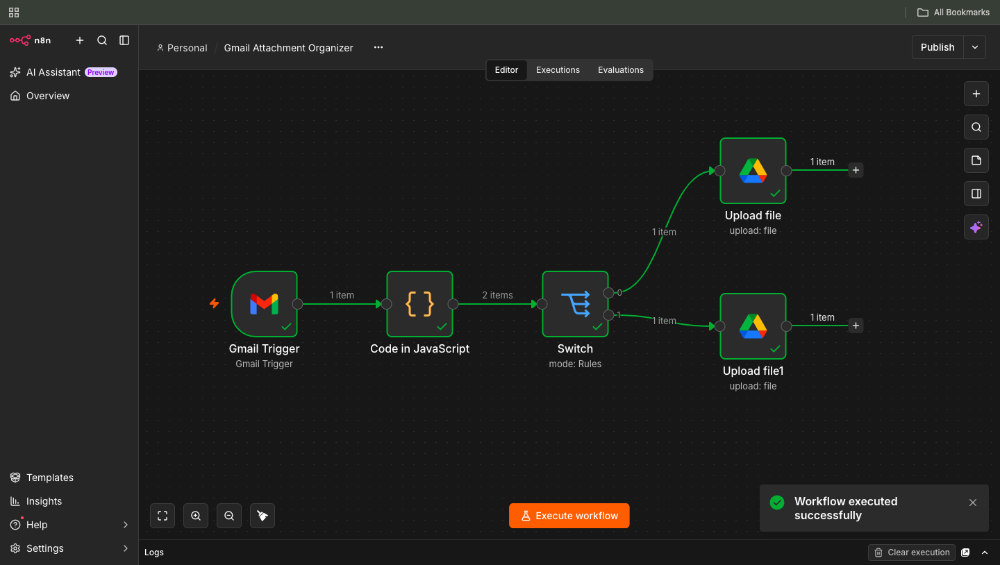

# Gmail Attachment Saver
Gmail → Images & PDFs to Google Drive

## Workflow Objective

This workflow automatically monitors a Gmail inbox for incoming emails with attachments and stores attachments in Google Drive based on file type.

Image files are uploaded to an Images folder, while PDF files are uploaded to a PDFs folder.

---

## Workflow Logic:

- Gmail Trigger monitors the inbox for new emails.
- A Code node extracts all email attachments and converts each attachment into a separate workflow item.
- A Switch node checks the MIME type of each attachment.
- Image files are routed to an Images folder in Google Drive.
- PDF files are routed to a PDFs folder in Google Drive.
- Attachments are uploaded automatically without manual intervention.

---

## Workflow Design

```text
Gmail Trigger
      ↓
Code (Split Attachments)
      ↓
Switch (MIME Type)
   ↙         ↘
Images       PDFs
   ↓           ↓
Google Drive  Google Drive
```

---


## Nodes Used

| Node | Purpose |
|--------|---------|
| Gmail Trigger | Monitors a test Gmail inbox for incoming emails |
| Code (JavaScript) | Splits all email attachments into separate workflow items |
| Switch | Routes attachments based on MIME type |
| Google Drive Upload (Images) | Uploads image files to the Images folder |
| Google Drive Upload (PDFs) | Uploads PDF files to the PDFs folder |

---

## Assumptions

- Incoming emails contain one or more attachments.
- Only image and PDF files are processed.
- Google Drive folders already exist.
- Test Gmail and Google Drive accounts were used.

---

## Testing Performed

| Test Case | Expected Result | Actual Result | Status |
|------------|----------------|---------------|---------|
| Single PNG attachment | Uploaded to Images folder | Uploaded successfully | ✅ Pass |
| Single PDF attachment | Uploaded to PDFs folder | Uploaded successfully | ✅ Pass |
| Email with PNG and PDF attachments | Files routed to correct folders | Files routed correctly | ✅ Pass |
| Email with multiple image attachments | All images uploaded | All images uploaded | ✅ Pass |
| Email with no attachments | No files processed | No files processed | ✅ Pass |

---

## Outcome

The workflow successfully separates image and PDF attachments and uploads them to their respective Google Drive folders automatically.



