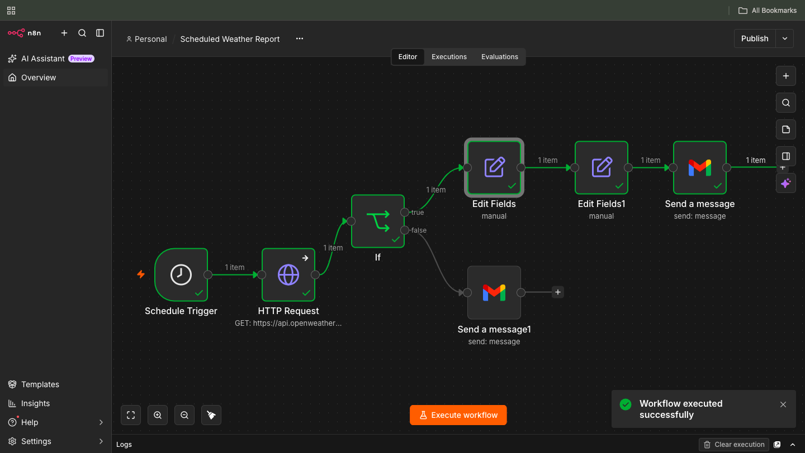

# Weather Report Workflow

## Workflow Name

Weather Report Workflow

---

## Workflow Objective

This workflow automatically retrieves current weather information from the OpenWeatherMap API at a scheduled time, formats the weather data into a readable report, generates personalized recommendations based on weather conditions, and delivers the report via Gmail.

The workflow also includes error handling to ensure that weather API failures generate a user-friendly notification rather than silently failing.

This project demonstrates key n8n concepts including:

- Scheduled automation
- API integration
- Data transformation
- Conditional logic
- Dynamic message generation
- Email delivery
- Error handling
- Credential management

---

## Workflow Logic

1. A Schedule Trigger initiates the workflow at a predefined interval.
2. The workflow calls the OpenWeatherMap API via an HTTP Request node.
3. Weather information is extracted from the API response.
4. Relevant weather fields are mapped into a simplified structure.
5. A dynamic recommendation is generated based on weather conditions.
6. A formatted weather report is sent via Gmail.
7. If the API request fails, a failure notification is sent instead.

---

## Workflow Design

```text
Schedule Trigger
        ↓
HTTP Request
(OpenWeatherMap API)
        ↓
IF Weather Data Exists
      ┌─────────────┴─────────────┐
      │                           │
Success                     API Failure
      │                           │
Edit Fields              Gmail Notification
(Weather Data)          "Weather Report Unavailable"
      │
Edit Fields
(Suggestion Logic)
      │
Gmail
(Daily Weather Report)
```

---

## Nodes Used

| Node | Purpose |
|----------|----------|
| Schedule Trigger | Runs workflow automatically |
| HTTP Request | Retrieves weather data from OpenWeatherMap |
| IF | Checks whether valid weather data was returned |
| Edit Fields | Maps API response fields into readable format |
| Edit Fields | Generates weather recommendation |
| Gmail | Sends weather report |
| Gmail | Sends failure notification |

---

## Required Credentials

### OpenWeatherMap API

Used by the HTTP Request node.

Required to:

- Retrieve current weather data
- Retrieve weather conditions
- Retrieve humidity levels
- Retrieve temperature information

### OpenWeatherMap API Credential Configuration

The OpenWeatherMap API key is stored securely in n8n using the built-in Credential Manager and is never hardcoded directly into workflow nodes.

Configuration Steps:

```text
n8n
→ Credentials
→ Create Credential
→ OpenWeatherMap API
→ API Key
```

The generated API key from OpenWeatherMap was saved in the credential and referenced by the workflow through the credential selector in the HTTP Request node.

Benefits:

- API keys are not visible in workflow nodes.
- Credentials are encrypted and stored separately from workflow definitions.
- Exported workflow JSON files contain only credential references.
- API secrets are excluded when pushing workflow files to GitHub.

Example:

```text
Credential Name:
OpenWeatherMap API

Authentication:
API Key

Storage:
n8n Credential Manager
```

This approach satisfies the repository security requirement that API keys, tokens, and passwords must not appear in exported workflow files.

### Gmail OAuth2

Used by Gmail nodes.

Required to:

- Send daily weather reports
- Send API failure notifications

---

## Setup Instructions

### Step 1: Create OpenWeatherMap Account

1. Register for a free OpenWeatherMap account.
2. Verify your email address.
3. Generate an API key.
4. Store the API key securely.

Example:

```text
Account
→ API Keys
→ Create Key
```

---

### Step 2: Configure Gmail Credentials

1. Enable Gmail API in Google Cloud Console.
2. Create OAuth credentials.
3. Configure Gmail OAuth2 credentials in n8n.
4. Authorize your Gmail account.

---

### Step 3: Configure Schedule Trigger

During testing:

```text
Every 2 Minutes
```

Before exporting:

```text
Daily
08:00 AM (IST)
```

---

## Workflow Components

### 1. Schedule Trigger

The Schedule Trigger automatically starts the workflow.

Testing Configuration:

```text
Every 2 Minutes
```

Production Configuration:

```text
Daily
08:00 AM
```

This ensures the weather report is delivered automatically without manual intervention.

---

### 2. HTTP Request Node

The HTTP Request node calls the OpenWeatherMap API.

Example Endpoint:

```http
https://api.openweathermap.org/data/2.5/weather
```

Query Parameters:

```text
q=London,UK
units=metric
```

Sample Response:

```json
{
  "weather": [
    {
      "main": "Clouds",
      "description": "few clouds"
    }
  ],
  "main": {
    "temp": 15.68,
    "feels_like": 14.92,
    "humidity": 62
  }
}
```

---

### 3. IF Node (Weather Data Validation)

The workflow validates whether the API request succeeded.

Expression:

```javascript
{{ $json.main !== undefined }}
```

Result:

```text
TRUE  → Continue Workflow
FALSE → Send Failure Notification
```

This prevents the workflow from silently failing when the API is unavailable.

---

### 4. Edit Fields (Weather Data Mapping)

The API response is simplified into business-friendly fields.

Configured Fields:

```javascript
Temperature:
{{ $json.main.temp }}

Feels_Like:
{{ $json.main.feels_like }}

Humidity:
{{ $json.main.humidity }}

Main_Condition:
{{ $json.weather[0].main }}

Condition:
{{ $json.weather[0].description }}
```

Example Output:

```json
{
  "Temperature": 15.68,
  "Feels_Like": 14.92,
  "Humidity": 62,
  "Main_Condition": "Clouds",
  "Condition": "few clouds"
}
```

This structure simplifies downstream processing.

---

### 5. Edit Fields (Weather Recommendation)

A second Edit Fields node generates a weather recommendation.

Expression:

```javascript
{{
$json.Condition.toLowerCase().includes('heavy rain')
? 'Heavy rain expected. Avoid unnecessary travel.'
: $json.Condition.toLowerCase().includes('light rain')
? 'Carry an umbrella.'
: $json.Main_Condition === 'Rain'
? 'Carry an umbrella.'
: $json.Main_Condition === 'Clear'
? 'Enjoy your day.'
: $json.Main_Condition === 'Clouds'
? 'Weather looks pleasant. Have a great day.'
: 'Stay prepared and have a great day.'
}}
```

Examples:

| Condition | Suggestion |
|------------|------------|
| Heavy Rain | Heavy rain expected. Avoid unnecessary travel. |
| Light Rain | Carry an umbrella. |
| Rain | Carry an umbrella. |
| Clear | Enjoy your day. |
| Clouds | Weather looks pleasant. Have a great day. |
| Other Conditions | Stay prepared and have a great day. |

---

### 6. Gmail Node (Weather Report)

The Gmail node sends the weather report.

Subject:

```text
Daily Weather Report
```

Message:

```text
Good Morning,

Today's Weather Report

Temperature: {{$json.Temperature}}°C

Feels Like: {{$json.Feels_Like}}°C

Humidity: {{$json.Humidity}}%

Conditions: {{$json.Condition}}

Suggestion:
{{$json.Suggestion}}

Generated automatically by n8n.
```

Example Email:

```text
Daily Weather Report

Good Morning,

Today's Weather Report

Temperature: 15.68°C

Feels Like: 14.92°C

Humidity: 62%

Conditions: few clouds

Suggestion:
Weather looks pleasant. Have a great day.
```

---

### 7. Gmail Node (Failure Notification)

If the weather API call fails, the workflow sends a separate email notification.

Subject:

```text
Weather Report Unavailable
```

Message:

```text
Good Morning,

Weather report unavailable.

The weather service could not be reached or returned invalid data.

Please check the API configuration and try again later.
```

This ensures failures are visible and actionable.

---

## Sample Input

Example OpenWeatherMap Response:

```json
{
  "weather": [
    {
      "main": "Rain",
      "description": "light rain"
    }
  ],
  "main": {
    "temp": 28,
    "feels_like": 31,
    "humidity": 85
  }
}
```

---

## Sample Output

```text
Daily Weather Report

Temperature: 28°C

Feels Like: 31°C

Humidity: 85%

Conditions: light rain

Suggestion:
Carry an umbrella.
```

---

## Testing Performed

| Test Case | Expected Result | Status |
|------------|----------------|---------|
| Schedule trigger executes | Workflow starts automatically | ✅ Pass |
| API returns weather data | Report generated successfully | ✅ Pass |
| Temperature displayed | Correct value shown | ✅ Pass |
| Feels-like displayed | Correct value shown | ✅ Pass |
| Humidity displayed | Correct value shown | ✅ Pass |
| Conditions displayed | Correct value shown | ✅ Pass |
| Rain detected | Umbrella recommendation generated | ✅ Pass |
| Clear weather detected | Enjoy your day recommendation generated | ✅ Pass |
| Gmail delivery | Email received successfully | ✅ Pass |
| Invalid API response | Failure email sent | ✅ Pass |
| API unavailable | Failure email sent | ✅ Pass |

---

## Security Considerations

The workflow uses n8n Credential Manager for all secrets.

Credentials are not hardcoded in workflow nodes.

### Credential Security

All sensitive values are managed through n8n Credentials rather than being embedded directly within workflow nodes.

The workflow references:

```text
OpenWeatherMap API Credential
Gmail OAuth2 Credential
```

instead of:

```text
https://api.openweathermap.org/...&appid=YOUR_API_KEY
```

or any hardcoded authentication values.

When the workflow is exported, n8n stores only credential references, ensuring that API keys, OAuth tokens, and client secrets are not exposed in the exported JSON files.

Protected Credentials:

- OpenWeatherMap API Key
- Gmail OAuth Credentials

Before exporting the workflow:

✅ Verify no API keys are visible

✅ Verify no OAuth tokens are visible

✅ Export credentials separately from workflow JSON

---

## Assumptions

- Internet access is available.
- OpenWeatherMap API key is valid.
- Gmail OAuth credentials are configured.
- The selected city remains static unless modified.
- Weather recommendations are based on current conditions only.

---

## Workflow Screenshot



---

## Outcome

The Weather Report Workflow successfully automates daily weather reporting using real-time API data.

This workflow demonstrates:

- Scheduled Automation
- REST API Integration
- Data Mapping
- Dynamic Recommendations
- Conditional Logic
- Email Automation
- Error Handling
- Credential Management
- Production-Ready Workflow Design

The solution provides a reusable foundation for weather alerts, monitoring systems, daily notifications, and other API-driven automation workflows.