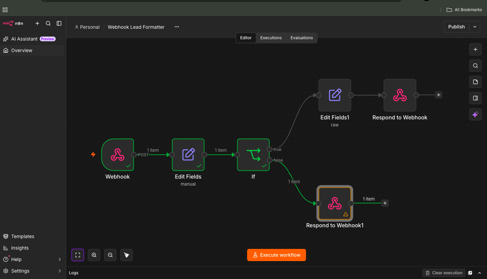

# Webhook Lead Formatter

## Workflow Name

Webhook Lead Formatter

---

## Workflow Objective

This workflow receives lead information through an HTTP POST webhook endpoint, validates required fields, standardises the incoming data structure, and returns a success or error response to the sender.

The workflow demonstrates core n8n concepts including webhooks, data transformation, conditional logic, validation, and API responses.

---

## Workflow Logic

1. A Webhook node receives incoming lead submissions via an HTTP POST request.
2. An Edit Fields node extracts and standardises the incoming lead information.
3. An IF node validates that all required fields are present:
   - First Name
   - Email Address
   - Company Name
4. If validation succeeds, the workflow generates a success response.
5. If validation fails, the workflow generates an error response.
6. A Respond to Webhook node returns the appropriate JSON response to the requesting client.

---

## Workflow Design

```text
Webhook (POST)
      ↓
Edit Fields
      ↓
IF
(first_name exists
AND
email exists
AND
company exists)

TRUE
 ↓
Edit Fields (Success Message)
 ↓
Respond to Webhook

FALSE
 ↓
Respond to Webhook (Error Message)
```

---

## Workflow Components

### 1. Webhook (POST)

The workflow begins with a Webhook node configured to accept HTTP POST requests.

This node serves as the entry point for incoming lead submissions.

Example payload:

```json
{
  "first_name": "Sarah",
  "surname": "Doe",
  "email": "sarah@example.com",
  "phone": "+41-333-333-333",
  "company": "ABC Logistics"
}
```

---

### 2. Edit Fields (Manual Mapping)

The Edit Fields node uses Manual Mapping mode to standardise incoming lead data from the webhook payload.

Incoming fields from the webhook request body are mapped into a consistent structure used throughout the remainder of the workflow.

Configured mappings:

| Field | Source |
|---------|---------|
| first_name | `$json.body.first_name` |
| surname | `$json.body.surname` |
| email | `$json.body.email` |
| phone | `$json.body.phone` |
| company | `$json.body.company` |

Example output:

```json
{
  "first_name": "John",
  "surname": "Doe",
  "email": "john.doe@example.com",
  "phone": "+41-333-333-333",
  "company": "ABC Ltd"
}
```

Using Manual Mapping ensures all incoming lead submissions conform to a predictable structure before validation is performed.

---

### 3. IF Node

The IF node performs validation checks against required fields.

Validation Rules:

```text
first_name exists
AND
email exists
AND
company exists
```

All three conditions must be satisfied before the lead is accepted.

---

### 4. Edit Fields (Success Response)

If validation succeeds, a success response object is created.

Example:

```json
{
  "status": "success",
  "message": "Lead accepted"
}
```

---

### 5. Respond to Webhook (Success)

Returns a success response to the calling application.

Example response:

```json
{
  "status": "success",
  "message": "Lead accepted"
}
```

---

### 6. Respond to Webhook (Error)

If validation fails, the workflow follows the negative branch and returns a plain text error message to the sender.

Response:

```text
Validation Failed

Lead submission could not be processed because one or more required fields are missing.

Required fields:
- first_name
- email
- company

Please verify and resubmit the request with all mandatory fields included..
```

This provides immediate feedback to the requesting application and indicates which fields are required for successful processing.

---

## Nodes Used

| Node | Purpose |
|--------|---------|
| Webhook (POST) | Receives incoming lead submissions |
| Edit Fields (Manual Mapping) | Maps incoming webhook fields into a standardised lead structure |
| IF | Validates required lead fields |
| Edit Fields (Success) | Creates a successful validation response |
| Respond to Webhook (Success) | Returns successful processing confirmation |
| Respond to Webhook (Error) | Returns a plain text validation error message |

---

## Assumptions

- Lead submissions are sent as JSON payloads.
- Required fields are:
  - First Name
  - Email Address
  - Company Name
- Surname and Phone Number are optional.
- The workflow is tested using sandbox data only.
- No production systems or live customer data were used.

---

## Sample Test Payload

```json
{
  "first_name": "John",
  "surname": "Doe",
  "email": "john,doe@example.com",
  "phone": "+41-333-333-333",
  "company": "ABC Ltd"
}
```

---

## Testing Performed

| Test Case | Expected Result | Status |
|------------|----------------|---------|
| Valid lead submission | Lead accepted and success response returned | ✅ Pass |
| Missing email field | Lead rejected and error response returned | ✅ Pass |
| Missing first name field | Lead rejected and error response returned | ✅ Pass |
| Missing company field | Lead rejected and error response returned | ✅ Pass |
| Optional phone field omitted | Lead accepted | ✅ Pass |
| Optional surname field omitted | Lead accepted | ✅ Pass |
| Additional fields included | Extra fields ignored | ✅ Pass |

---

## Testing Method

The workflow was tested using both cURL and n8n's Webhook Test URL.

Example cURL request:

```bash
curl -X POST http://localhost:5678/webhook-test/lead \
-H "Content-Type: application/json" \
-d '{
  "first_name":"John",
  "surname":"Doe",
  "email":"john.doe@example.com",
  "phone":"+41-333-333-333",
  "company":"ABC Ltd"
}'
```

The request successfully triggered the workflow and returned the expected response.

---

## Workflow Screenshot



---

## Demo Video

Recorded walkthrough:


---

## Outcome

The workflow successfully receives lead information via a webhook endpoint, transforms incoming data into a consistent structure, validates business-critical fields, and returns structured success or error responses.

This project demonstrates practical use of:

- Webhooks
- HTTP POST requests
- Data transformation
- Field mapping
- Conditional logic
- Validation
- Error handling
- API responses
- Workflow documentation

It provides a foundation for more advanced CRM and lead-processing automations.